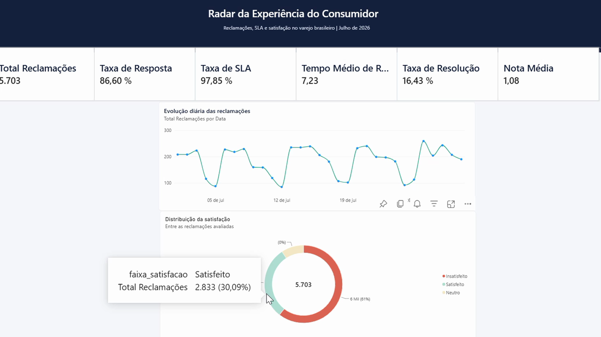
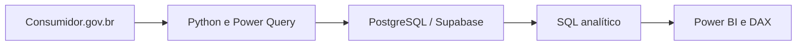

# Radar da Experiência do Consumidor

Análise de reclamações, SLA, resolução e satisfação no varejo brasileiro a partir dos dados públicos do **Consumidor.gov.br**.

[](https://app.powerbi.com/view?r=eyJrIjoiMmVlZDMxMWMtZjVjZC00ZTZhLWFkNjgtYmJmM2VlMWY0YjhmIiwidCI6IjYwOGYzNGZlLTUyMTQtNDBmZi05ZjI2LWFjN2MzNzUwMGI3NyJ9)


> **[Acessar o dashboard interativo no Power BI](https://app.powerbi.com/view?r=eyJrIjoiMmVlZDMxMWMtZjVjZC00ZTZhLWFkNjgtYmJmM2VlMWY0YjhmIiwidCI6IjYwOGYzNGZlLTUyMTQtNDBmZi05ZjI2LWFjN2MzNzUwMGI3NyJ9)**



**Demonstração:** [assistir ao vídeo do dashboard](assets/dashboard-demo.mp4)

## Visão geral

O projeto investiga se as empresas do varejo brasileiro apenas respondem às reclamações ou se realmente conseguem resolvê-las e gerar uma experiência satisfatória. O recorte contém **25.691 reclamações finalizadas em julho de 2026**.

O fluxo analítico combina preparação e validação dos dados, consultas SQL em PostgreSQL/Supabase e um dashboard executivo em Power BI com quatro páginas:

1. **Visão Executiva** — volume, resposta, SLA, resolução, satisfação e evolução diária.
2. **Empresas** — ranking de reclamações e comparação de desempenho.
3. **Problemas e Canais** — motivos mais recorrentes e canais de compra.
4. **Geografia** — distribuição e indicadores por UF.

## Principais indicadores

| Indicador | Resultado |
|---|---:|
| Total de reclamações | 25.691 |
| Reclamações respondidas | 22.255 |
| Taxa de resposta | 86,63% |
| Respostas dentro do SLA | 20.565 |
| Taxa de SLA | 92,41% |
| Tempo médio de resposta | 7,72 dias |
| Reclamações avaliadas | 9.414 |
| Taxa de avaliação | 36,64% |
| Reclamações resolvidas | 4.358 |
| Taxa de resolução | 46,29% |
| Nota média | 2,36 / 5 |
| Taxa de insatisfação | 60,58% |

## Insights de negócio

- **Responder não significa resolver:** apesar de 86,63% das reclamações serem respondidas e 92,41% das respostas cumprirem o SLA, apenas 46,29% das reclamações avaliadas foram resolvidas.
- **A experiência ainda é frágil:** a nota média foi de 2,36/5 e 60,58% das avaliações indicaram insatisfação.
- **O volume é concentrado:** Shopee Brasil e Amazon.com.br somaram 9.497 reclamações, aproximadamente 37% de todo o recorte.
- **A operação digital domina o problema:** Internet foi o principal canal de compra, e não entrega/atraso e reembolso/retenção de valores lideraram os motivos registrados.
- **São Paulo liderou em volume:** o estado concentrou 6.628 reclamações entre as dez UFs apresentadas no painel geográfico.

## Perguntas respondidas

- Qual é o volume de reclamações e como ele evolui ao longo do mês?
- As empresas respondem dentro do prazo de até 10 dias?
- Qual é a diferença entre taxa de resposta e taxa de resolução?
- Quais empresas, problemas, canais e estados concentram mais reclamações?
- Como resolução e satisfação variam entre empresas e UFs?

## Arquitetura do projeto



## Tecnologias e competências

- **Python:** definição do problema, regras de negócio, preparação e validação da base.
- **PostgreSQL / Supabase:** estrutura da tabela, validações, KPIs, views, rankings, Pareto e segmentação.
- **Power Query:** tipagem, tratamento regional de números e preparação para o modelo.
- **Power BI / DAX:** modelo estrela, tabela calendário, medidas, filtros e storytelling visual.
- **Análise de negócio:** SLA, experiência do consumidor, satisfação, resolução e priorização operacional.

## Estrutura do repositório

```text
consumer-complaints-retail-analysis/
├── assets/
│   ├── dashboard-demo.mp4
│   └── dashboard-preview.png
├── data/
│   └── README.md
├── docs/
│   ├── data_dictionary.md
│   └── methodology.md
├── notebooks/
│   └── 01_business_understanding_radar_cx.ipynb
├── power-bi/
│   └── 03_medidas_dax.md
├── sql/
│   └── 02_consultas_sql_consumidor_varejo.sql
├── .gitignore
├── LICENSE
└── README.md
```

## Fonte e escopo dos dados

- **Fonte:** [Dados Abertos do Consumidor.gov.br](https://www.consumidor.gov.br/pages/dadosabertos/externo/)
- **Período:** 1º a 31 de julho de 2026
- **Recorte:** empresas e segmentos classificados como varejo
- **Granularidade:** uma linha por reclamação finalizada
- **Volume analisado:** 25.691 registros e 25 campos tratados

Os arquivos brutos e o `.pbix` não são versionados para evitar a exposição desnecessária dos registros detalhados. O dashboard completo pode ser explorado pelo link público acima.

## Cuidados metodológicos

- Os resultados representam reclamações registradas na plataforma, não todo o universo de consumidores do mercado.
- Indicadores de nota e resolução utilizam somente reclamações avaliadas; por isso, o denominador é diferente do total geral.
- Comparações entre empresas devem considerar o volume de reclamações e a quantidade de avaliações válidas.
- A análise é um retrato de julho de 2026 e não deve ser interpretada como tendência histórica.

## Autora

**Javiera Constanza Lobos Andrews**  
Transição de carreira de Nutrição para Análise de Dados, São Paulo — Brasil.  
[GitHub](https://github.com/Javieralobosandrews-19)

---

### English summary

Portfolio project analyzing **25,691 Brazilian retail complaints** from Consumidor.gov.br. The solution combines Python-based business understanding and data preparation, PostgreSQL/Supabase analytical SQL, and a four-page Power BI dashboard focused on response rate, SLA compliance, resolution, satisfaction, companies, complaint drivers, purchase channels, and geographic distribution.
